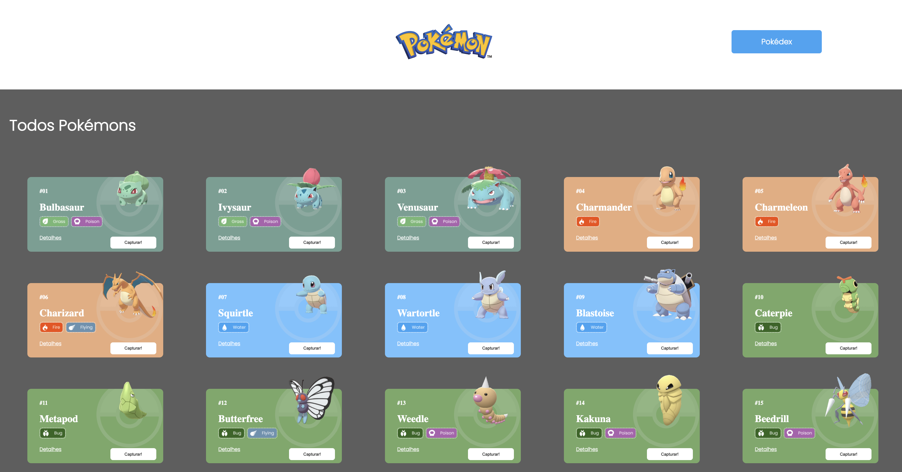

# Projeto de Frontend com REACT e APIs

Uma Pokedéx feita para exercicitar novas habilidades. 

## Índice
- <a href="#funcionalidades">Funcionalidades </a>
- <a href="#layout">Layout</a>
- <a href="#demonstracao">Demonstração </a>
- <a href="#tecnologias"> Técnologias Utilizadas </a>
- <a href="rodar">Como rodar este projeto ? </a>

## Funcionalidades
- [x] Página Home exibe uma lista de Pokemons que é recuperada através de uma API REST. 
- [x] Cada Pokemon é representado por um Card. 
- [x] Em cada card, há um botão para adicioná-lo à Pokédex e  um link para acessar a página de detalhes do Pokemon. 
- [x] O Header da página Home possui um botão para acessar a Pokédex. 
- [x] A página da Pokédex renderiza a lista de Pokemons adicionados (capturados). 
- [x] Em cada card, há um botão para removê-lo da Pokédex e um link para acessar a página de detalhes do Pokemon. 
- [x] A página de Detalhes apresenta as demais informações sobre o Pokemon. 
- [x] O Header da página Detalhe possui um botão para remover o Pokemon da Pokédex.  

## Layout


## Demonstração
[Clique aqui!](http://glaucia-projeto-frontendc.surge.sh/)

## Técnologias Utilizadas
- React 
- React Router
- React Context
- Axios
- Styled Components
- Hoocks (controle de estado, ciclo de vida do componente e custom hooks. )

## Como rodar este projeto
```bash
# Clone este diretório 
git clone https://github.com/glauciasonda/projeto-react-apis.git

# Acesse a pasta do projeto no seu terminal 
cd projeto-react-apis

# Instale as dependencias
npm install 

# Execute a aplicação
npm run start 

# A aplicação será iniciada na porta 3000, acesse pelo navegador:  http://localhost:3000

```

